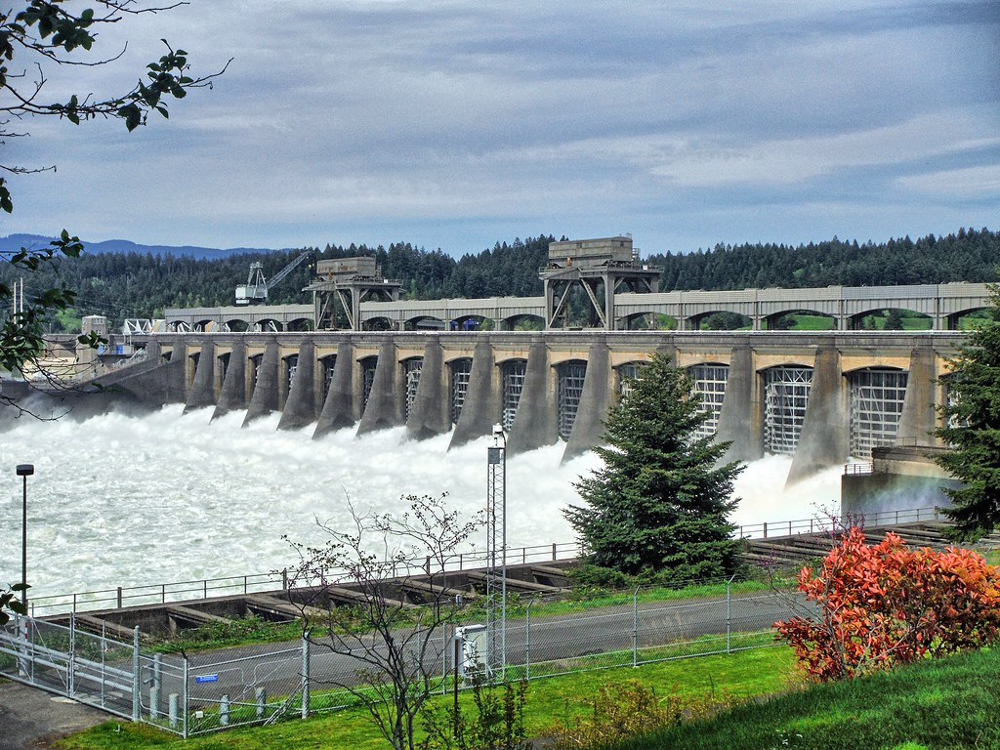

```{r setup, include=FALSE}
knitr::opts_chunk$set(echo = TRUE, message = FALSE, warning = FALSE)

## Load Packages
library(tidyverse)
library(lubridate)
library(tsibble)
library(paletteer)
library(janitor)
library(palettetown)
library(fabletools)
library(fable)
library(feasts)
library(forecast)
library(harrypotter)
library(ggimage)

## Read in data and clean names 

passage_raw <- read_csv("cbr_fish_passage_bonneville_allyrs_steelhead.csv") %>% 
  clean_names()

# read in image

dam <- "bonneville.png"
```

 

### ***Introduction***  
The Bonneville Dam on the Columbia and Snake Rivers in Oregon was initially built in 1938, and provides hydropower to the Pacific Northwest. Scientists have been collecting data on fish passage across the Bonneville Dam since the erection of the dam, as this is a vital habitat for many species. This analysis shows the daily, seasonal, and annual passage counts for Adult Steelhead Salmon passage across the Bonneville Dam.  

**Citation**.  
*Data:* Citation: Columbia River DART, Columbia Basin Research, University of Washington. (2019). Adult Passage Graphics & Text. Available from http://www.cbr.washington.edu/dart/query/adult_graph_text  

*Background:* Portland District Website. https://www.nwp.usace.army.mil/bonneville/. Accessed 20 Feb. 2020.

```{r, echo = FALSE}

#

```


  
  **Bonneville Dam**
<br>

### ***Data Wrangling, Exploration, and Visualization***


#### 1. Wrangling and Exploration
```{r Clean Dates}

## Clean up date. Right now the year is in one column and the day-month is in a separate column together. 


passage_clean <- passage_raw %>%
  mutate(date = paste(year, mm_dd, sep = "-")) %>% 
  mutate(yr_mo_day = lubridate::parse_date_time(date, "ydm"), # adding a new column called yr_mo_day using lubridate. Sometimes need to explicitly state you're using lubridate within code even though it's loaded
    yr_mo_day = as.Date(yr_mo_day), # specifying yr_mo_day as date 
    month_sep = yearmonth(yr_mo_day) ) %>% # Just pull year and month separated from the yr_mo_day column--> Want to coerce this to tsibble format as year_month - so that when we use feast to fable later on it's in the correct format (feast to fable needs it to be in tsibble format). Yearmonth is tsibble specific date format
  mutate( month = month(yr_mo_day, label = TRUE)) %>% 
  select(-mm_dd, -datatype, -location, -parameter, -unit) %>% #Select out these columns 
  drop_na(month_sep, value) #Drop any NA values in months 


```

<br>

#### 2. Visualization  
**Exploratory Plot:** 
```{r Exploratory Plot}

# Look at cleaned data

passage_gg <- ggplot(data = passage_clean, aes(x = month_sep, 
                                               y = value)) +
  geom_line()


passage_gg


min(passage_clean$value) # Why are there negative values? Min = -75
max(passage_clean$value) # Max = 34053


```
<br>

**Finalized Time Series Plot of Daily Data:** 
```{r Finalized plot}


passage_daily <- ggplot(data = passage_clean, aes(x = month_sep, 
                                               y = value)) +
  geom_line() +
  theme_minimal() +
  ylab("Number of Adult Steelhead Salmon Passages") +
  xlab("Date") +
  ggtitle("Adult Steelhead Salmon Passages Across \n Bonneville Dam, Oregon") +
  theme(plot.title = element_text(hjust=0.5, face="bold")) 

passage_daily

#min(passage_clean$value) # -75
#max(passage_clean$value) # 34053

```
  
**Figure 1. Daily Adult Steelhead Salmon Passage Across Bonneville Dam (1940 - 2019).** Steelhead salmon passage fluctuates daily. The minimum number of passages was zero during this time period, while the maximum number 34,053, which occurred on August 13, 2009.

<br>

**Finalized Season Plot:**
```{r}

### A finalized seasonplot to explore if/how monthly passage has shifted over time 

# Group by month and total value counts by month 
passage_month <- passage_clean %>%
  group_by(month, year) %>% 
  summarize(month_total = sum(value))

max(passage_month$month_total)
# Max: 353478


# Coerce into tsibble:
#passage_ts <- as_tsibble(passage_clean, key = value, index = month_sep) # Index is tsibble compatable time variable we've created. So far we've created one variable that's using tsibble funciton which is month_sep 
# ^^^ This wasn't working? Need to check 

### Visualize in ggplot
# Season plot -- within each season, if I plot each of the years separately, how is that changing?

passage_season_plot <- ggplot(data = passage_month, aes(x = month, y = month_total, group = year)) + # using month parsed version so we can facet wrap by year
  geom_line(aes(color = year)) + # Want each year to have a different color
  scale_y_continuous(breaks = seq(0, 400000, by = 50000), labels = scales::comma) +
  theme_minimal() + 
  ylab("Adult Steelhead Salmon Passage") +
  xlab("Month") +
  ggtitle("Seasonal Adult Steelhead Salmon Passage (1940 - 2019)") +
  guides(color = guide_legend(title = "Year"))

# passage_season_plot

# Update color scheme with continuous paletteer 

passage_season_plot + 
  scale_color_paletteer_c("harrypotter::lunalovegood")


```
  
  
**Figure 2. Seasonal Adult Steelhead Salmon Passage across Bonneville Dam (1940 - 2019)**. There is a general seasonality trend for steelhead salmon passage. There is high passage during the summer months between June and September. While there is much variability across years, generally more recent years show an increase in passage, there remains a seasonal trend across the entire study period. 

<br>


**Finalized Annual Plot:**
```{r}

### A finalized annual plot 

# Group by year and total value counts by year
passage_year <- passage_clean %>%
  group_by(year) %>% 
  summarize(year_total = sum(value))

max(passage_year$year_total)
# Max: 633073


### Visualize in ggplot


passage_annual_plot <- ggplot(data = passage_year, aes(x = year, y = year_total)) + 
  geom_line() +
  scale_y_continuous(breaks = seq(0, 700000, by = 50000), labels = scales::comma) +
  scale_x_continuous(breaks = seq(1940, 2020, by = 10)) +
  theme_minimal() + 
  ylab("Adult Steelhead Salmon Passage") +
  xlab("Year") +
  ggtitle("Annual Adult Steelhead Salmon Passage (1940 - 2019)") +
  guides(color = guide_legend(title = "Year"))

passage_annual_plot


```
  
**Figure 3. Annual Adult Steelhead Salmon Passage Across Bonneville Dam (1940 - 2019).** The passage of salmon across the Bonneville Dam varies greatly throughout the study period. While more recent years have seen an increase in passage, numbers dropped during the last year of study. 
